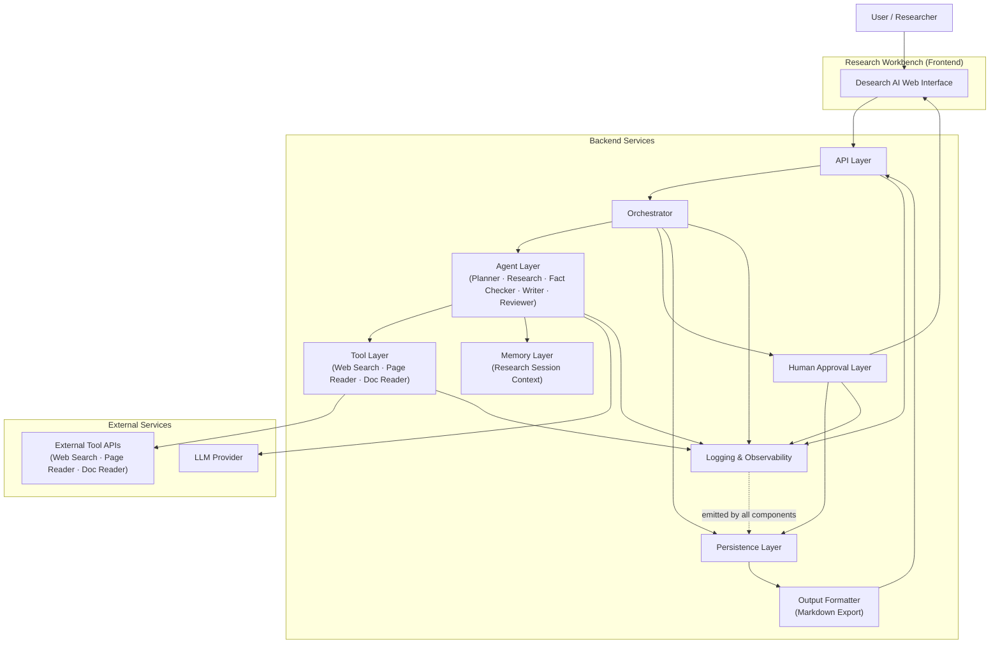
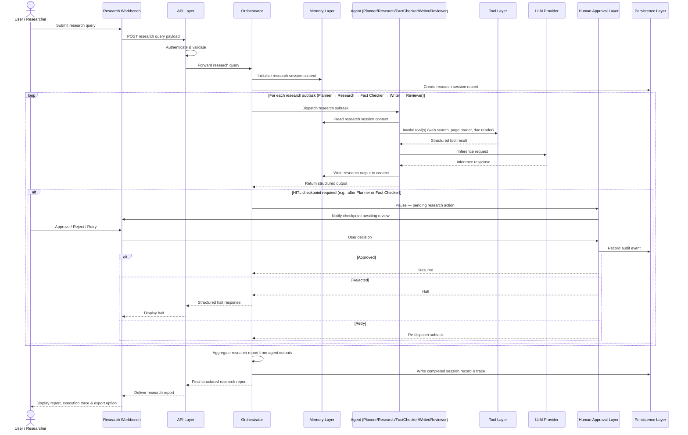
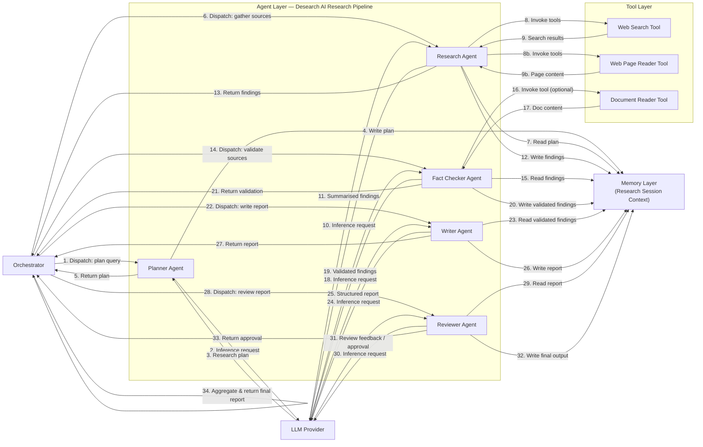
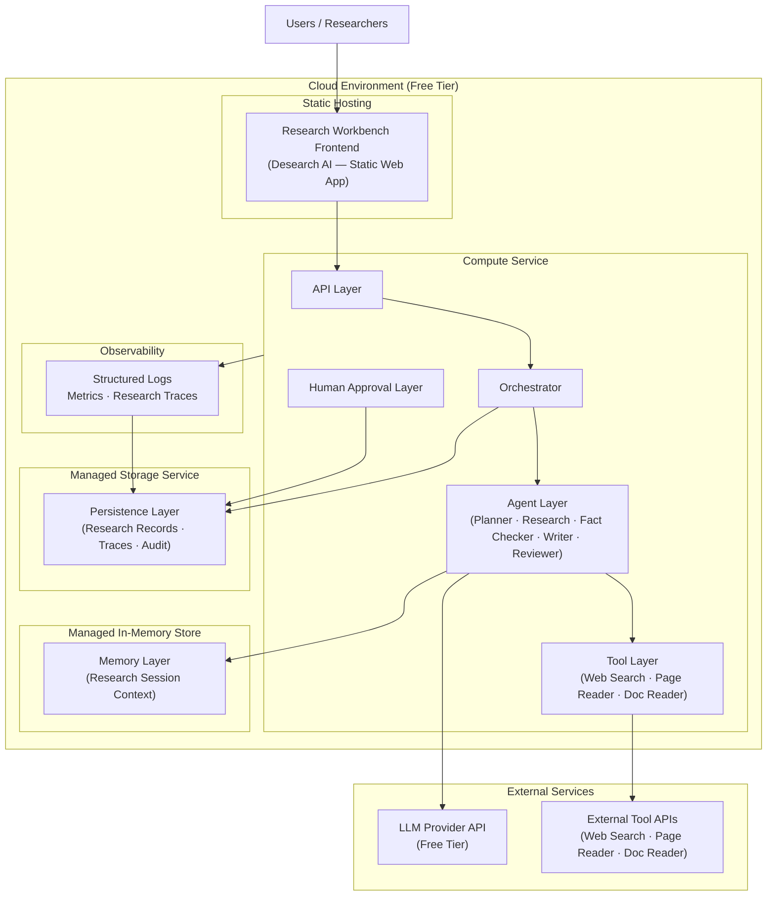

# System Architecture — Desearch AI

> Product: **Desearch AI** — Deep Research. Smarter Decisions.
> Derived from: `Docs/PROJECT_VISION.md`, `Docs/REQUIREMENTS.md`
> Updated: TICKET-007 — Product repositioning to Desearch AI
> Updated: Consistency Pass — Orchestrator/Planner boundary, agent specs, session lifecycle, confidence model, output formatter, operational limits
> Scope: MVP — High-Level Architecture Specification
> Status: Baseline

---

## System Overview

Desearch AI is a cloud-native, multi-agent research orchestration system designed to accept a natural language research query from a user and execute it through a coordinated pipeline of specialized research agents, external tools, and an LLM provider — with optional human review at configurable checkpoints.

The system is structured around a central orchestrator that receives a research query, decomposes it into an ordered research plan, and routes each research subtask to the most appropriate specialized agent. Agents operate with defined roles and bounded capabilities: the Planner scopes the work, the Research Agent gathers sources, the Fact Checker validates findings, the Writer produces the structured report, and the Reviewer ensures quality. They may invoke external tools (web search, web page reader, document reader) to ground their output in real, verifiable data. A shared session memory layer allows research findings to flow across agent hand-offs within a single research session. A human-in-the-loop approval layer pauses execution at designated checkpoints and waits for explicit user authorization before proceeding.

Every action in the system — agent invocations, tool calls, model requests, approvals, and failures — is recorded as a structured trace event. A logging and observability layer collects and exposes these events for audit, diagnosis, and monitoring.

The platform is deployed to a cloud environment and is publicly accessible via a stable URL. It operates entirely within free-tier service quotas and is designed to be modular, extensible, and replaceable at every integration point.

---

## High-Level Architecture

The platform is composed of ten distinct logical components. Each component has a clearly bounded responsibility. Components interact through well-defined interfaces; none are tightly coupled to another's internal implementation.

---

### 1. Frontend

**Responsibility:** Provide the user-facing interface through which all human interactions with the platform occur.

The frontend is a web application that serves as the entry point for users. It exposes three primary interaction surfaces:

- A **task submission interface** where users compose and submit multi-step task descriptions.
- An **execution monitor** that displays real-time or near-real-time status updates as agents process a task.
- An **approval interface** that surfaces human-in-the-loop checkpoints, presents the pending agent action, and collects the user's decision (approve, reject, or retry).
- An **execution history viewer** that allows users to retrieve and inspect the full execution trace of past tasks.

The frontend communicates exclusively with the API Layer. It does not interact directly with agents, the orchestrator, or any backend component. All state displayed in the frontend is derived from API responses.

---

### 2. API Layer

**Responsibility:** Expose a stable, authenticated interface between the frontend (and any external clients) and the platform's internal components.

The API Layer is the single entry point for all external requests. It enforces authentication (API key validation) on every inbound request. It routes task submissions to the Orchestrator, exposes endpoints for retrieving execution history and traces, and provides a mechanism for the frontend to poll or receive updates on task execution status.

The API Layer is also responsible for input validation: task payloads are sanitized and validated before being forwarded to the orchestrator. Rejected inputs are returned with structured error responses — never with raw internal errors.

The API Layer is stateless. It holds no task state itself; all state is maintained by downstream components.

---

### 3. Orchestrator

**Responsibility:** Coordinate end-to-end research session execution. Manage agent dispatch sequencing, approval checkpoint evaluation, result aggregation, and error recovery.

The Orchestrator is the execution coordinator of the platform. It does not perform research planning — that is exclusively the Planner Agent's responsibility. The Orchestrator receives a validated research query from the API Layer and a structured execution plan from the Planner Agent, then manages the following operations in sequence:

1. **Execution plan receipt** — Receive the structured execution plan produced by the Planner Agent from research session context. The plan defines the ordered list of research subtasks and the agent assigned to each.
2. **Agent selection** — For each subtask in the plan, identify the registered agent whose defined role matches the subtask requirements.
3. **Execution sequencing** — Dispatch subtasks to agents in the order defined by the plan, enforcing sequential execution where one subtask's output is required before the next can begin.
4. **Approval checkpoint evaluation** — Before dispatching a subtask at a configured approval checkpoint position, pause execution and route to the Human Approval Layer for user review.
5. **Result aggregation** — Collect structured outputs from all agents upon research session completion and assemble a consolidated final research report.
6. **Error coordination** — Receive failure signals from agents and decide whether to retry the failed subtask, reroute, or terminate the research session with a structured error response.

The Orchestrator maintains no persistent state beyond a single research session. Between research sessions, it is stateless.

> **Responsibility boundary — Planner Agent vs. Orchestrator:**
> The Planner Agent is responsible for *what* to research and *how* to structure the work (research scope, subtask definition, and execution plan). The Orchestrator is responsible for *executing* that plan: dispatching agents, managing checkpoints, aggregating results, and handling failures. The Orchestrator does not modify the plan it receives.

---

### 4. Agent Layer

**Responsibility:** Execute specialized research subtasks using LLM inference, tool invocations, and research session context.

The Agent Layer consists of five specialized research agents. Each agent:

- Has a defined **role** that describes the category of research subtasks it is responsible for.
- Has a bounded **tool set** — a list of registered tools it is authorized to invoke.
- Has **read/write access** to the shared research session context for the duration of the research session.
- Communicates **upward** to the Orchestrator with results, errors, or approval requests.
- Does **not** communicate directly with other agents; all inter-agent context flows through the Orchestrator and the research session context layer.

For the MVP, the platform includes the following five specialized research agents:

- A **Planner Agent** — receives the research query, produces a structured ordered execution plan, and writes it to research session context. Does not invoke tools. The Orchestrator reads the plan from context and begins dispatching subsequent agents.
- A **Research Agent** — reads the execution plan from research session context, invokes web search, web page reader, and document reader tools to collect source material, summarizes findings using LLM inference, and writes sourced findings to research session context.
- A **Fact Checker Agent** — reads the Research Agent's findings from research session context, validates key claims against their cited sources, scores each claim by confidence level, and writes validated findings (with confidence scores) to research session context.
- A **Writer Agent** — reads validated findings from research session context, synthesizes them into a structured research report conforming to the defined report output schema, and writes the completed report to research session context.
- A **Reviewer Agent** — reads the Writer Agent's report from research session context, evaluates it against the defined reviewer quality criteria, and either approves the report or writes structured improvement feedback to research session context for a retry.

Each agent follows a standard execution lifecycle: receive subtask → read research session context → invoke tools as needed → call LLM provider → write results to research session context → return structured output to Orchestrator.

---

### 5. Tool Layer

**Responsibility:** Provide agents with access to external data retrieval capabilities beyond LLM inference.

The Tool Layer contains the Tool Registry — the authoritative store of all external data retrieval tools available to agents. The Tool Layer is exclusively for tools that fetch or retrieve information from external sources. Report formatting and export are handled by the Output Formatter (Component 11), not the Tool Layer.

Each tool in the registry:

- Has a defined **name**, **description**, and **input/output schema** that agents and the Orchestrator can inspect.
- Accepts a structured input payload, performs an external data retrieval operation, and returns a structured output.
- Operates independently of other tools and agents.

For the MVP, the Tool Registry contains three data retrieval tools:

| Tool | Input | Output |
|---|---|---|
| **Web Search** | Query string | List of results: title, URL, snippet |
| **Web Page Reader** | URL | Extracted readable text content of the page |
| **Document Reader** | Document URL or identifier | Extracted text content of the document |

Tool failures are caught at the Tool Layer boundary. A failed tool invocation returns a structured error envelope to the invoking agent rather than propagating an unhandled exception.

---

### 6. Memory Layer

**Responsibility:** Maintain shared, session-scoped context that persists across agent hand-offs within a single task execution.

The Memory Layer provides a read/write context store that is scoped to a single task session. Its responsibilities are:

- **Initialize** a new, empty context at the start of each task session.
- **Accept writes** from agents at any point during task execution (e.g., intermediate results, extracted facts, prior decisions).
- **Serve reads** to any agent requiring context produced by a prior step.
- **Isolate** sessions from each other: no agent can read the memory of a different task session.
- **Clear** session memory at the end of task execution or on session expiry.

The Memory Layer does not perform reasoning or transformation on stored context. It is a passive store — agents determine what to write and what to read.

---

### 7. Human Approval Layer

**Responsibility:** Pause agent execution at designated checkpoints and collect an explicit user decision before allowing execution to continue.

The Human Approval Layer operates as a gate between the Orchestrator and the next step in an agent pipeline. When the Orchestrator determines that the current step requires human review, it:

1. Suspends execution of the pending agent action.
2. Records the pending action as a checkpoint requiring user input.
3. Notifies the frontend via the API Layer that a checkpoint is awaiting review.
4. Waits for a user response: approve, reject, or retry.

On **approval**, the checkpoint is resolved and execution resumes from the pending action.
On **rejection**, the checkpoint is resolved as rejected, the event is logged, and the task is halted or rerouted based on orchestrator policy.
On **retry**, the agent re-executes the pending action and presents its new output for review at the same checkpoint.

The Human Approval Layer maintains the state of open checkpoints. It ensures that no checkpoint is bypassed and that every resolution is logged with a timestamp and the user's decision.

---

### 8. Logging and Observability

**Responsibility:** Record every system event as a structured, queryable log entry and expose system health status.

The logging and observability component is not a separate service but a cross-cutting concern embedded into every other component. Every component emits structured log events at the point of action.

**Structured Logging:** Each log entry contains at minimum: timestamp, component identity, event type, session ID, input summary, output summary, status (success/failure), and duration.

**Execution Traces:** Each task execution produces a complete, ordered trace of every discrete event: agent invocations, tool calls, model requests, approval checkpoints, and terminal states.

**Audit Trail:** Every human approval decision is recorded as a non-repudiable audit event with: the user's identity (or session token), the pending action presented, the decision made, and the timestamp.

**Health Status:** The platform exposes a health indicator reflecting the operational status of its core components. This is used by deployment infrastructure and external evaluators to confirm the platform is running.

**Metrics:** The platform records operational metrics including: task completion rate, mean task execution duration, tool invocation counts and failure rates, LLM token usage per session, and approval checkpoint resolution times.

---

### 9. Persistence Layer

**Responsibility:** Store execution history, trace events, audit records, and checkpoint state durably across system restarts.

The Persistence Layer is the durable store for all data that must survive beyond the lifetime of a single process or request:

- **Task execution records** — the original task, the agents and tools involved, the final output, and the terminal status.
- **Execution trace events** — every structured log event emitted during task execution, keyed by session ID.
- **Approval checkpoint state** — the current state of any open or resolved checkpoints.
- **Audit records** — immutable records of every human approval decision.

The Persistence Layer is accessed by the Orchestrator, the Human Approval Layer, and the Logging and Observability component. The frontend accesses its contents indirectly through the API Layer.

The choice of persistence mechanism is intentionally deferred from this document. The interface to the Persistence Layer must be abstract enough that the underlying store can be replaced without modifying the components that depend on it.

---

### 10. LLM Provider Integration

**Responsibility:** Abstract access to the external language model inference endpoint.

The LLM Provider Integration component is the platform's interface to an external LLM provider. It accepts structured inference requests from agents, forwards them to the configured provider endpoint, and returns structured responses.

This component:

- Hides provider-specific request and response formats from agents. Agents interact with a uniform inference interface regardless of which provider is configured.
- Manages provider-specific concerns such as request formatting, token limit enforcement, and response parsing.
- Emits a structured log event for every inference request, including the model identifier, token counts, and response status.
- Is replaceable: swapping the LLM provider requires only reconfiguring this component, not modifying any agent or orchestrator logic.

---

## Request Lifecycle

The following describes the complete lifecycle of a task from user submission to final response.

```
1.  User opens the Desearch AI research workbench and submits a research query
    (e.g., "Compare Supabase vs Firebase for Enterprise SaaS").

2.  The Frontend validates that the input is non-empty and sends the task
    to the API Layer.

3.  The API Layer authenticates the request, validates the payload,
    and forwards the task to the Orchestrator.

4.  The Orchestrator decomposes the task into an ordered set of subtasks
    and identifies the appropriate agent for each.

5.  The Orchestrator initializes a new session in the Memory Layer
    and creates a task execution record in the Persistence Layer.

6.  The Orchestrator dispatches the first subtask to the assigned Agent.

7.  The Agent reads relevant context from the Memory Layer.

8.  The Agent invokes one or more Tools from the Tool Layer to gather
    or process information required for the subtask.

9.  The Tool executes the external operation, returns a structured result
    to the Agent, and logs the invocation event.

10. The Agent sends a structured inference request to the LLM Provider
    Integration component, incorporating tool results and session context.

11. The LLM Provider returns a response. The LLM Provider Integration
    component logs the inference event (model, tokens, status).

12. The Agent writes its result to the Memory Layer and returns a
    structured output to the Orchestrator.

13. The Orchestrator evaluates whether the next step requires a
    Human Approval checkpoint.

    If YES:
    13a. The Orchestrator suspends execution and writes the pending action
         to the Human Approval Layer.
    13b. The API Layer is notified; the Frontend surfaces the checkpoint
         to the user.
    13c. The user reviews the pending action and responds:
         - APPROVE → execution resumes at step 14.
         - REJECT  → task is halted; a structured halt response is logged
                     and returned to the user.
         - RETRY   → the Agent re-executes the pending action; flow
                     returns to step 8.

14. The Orchestrator dispatches the next subtask to its assigned Agent.
    Steps 7–13 repeat for each subtask.

15. Upon completion of all subtasks, the Orchestrator aggregates the
    outputs from all Agents into a consolidated, structured final response.

16. The Orchestrator writes the completed task record and full execution
    trace to the Persistence Layer.

17. The API Layer returns the final response to the Frontend.

18. The Frontend displays the result and the execution trace to the user.

    If ANY step raises an unhandled error:
    E1. The error is caught at the component boundary.
    E2. A structured error event is written to the Persistence Layer.
    E3. The Orchestrator evaluates the retry policy for the failed step.
    E4. If retries are not exhausted, flow returns to the failed step.
    E5. If retries are exhausted, a structured error response is returned
        to the API Layer and surfaced to the user.
```

---

## Agent Architecture

### Orchestrator

The Orchestrator is the central coordinator of the platform. It is not itself an agent — it does not perform reasoning or invoke tools. Its role is purely coordinative: it manages task decomposition, agent dispatch, checkpoint evaluation, result aggregation, and error handling.

The Orchestrator knows about registered agents through a manifest: a structured description of each agent's identity, role, and declared capabilities. It uses this manifest to make routing decisions. It does not hardcode knowledge of any specific agent; adding a new agent requires only updating the manifest.

The Orchestrator enforces execution ordering. It can dispatch subtasks sequentially (when one subtask's output is required as input to the next) or identify subtasks that can be dispatched concurrently (when they have no interdependencies).

The Orchestrator is stateless between tasks. It holds task state only for the duration of a single execution.

---

### Specialized Agents

Each specialized agent is an independent execution unit with three defining properties:

1. **Role** — a natural language description of the category of tasks the agent is qualified to perform. The Orchestrator uses this to make routing decisions.
2. **Tool set** — the list of tools the agent is authorized to invoke. An agent may not invoke tools outside its declared set.
3. **Execution logic** — the pattern by which the agent processes a subtask: read context, invoke tools, call LLM, write results, return output.

Agents are passive: they do not self-initiate, they do not communicate with each other directly, and they do not modify the Orchestrator's execution plan. Their scope is limited to executing the subtask they are given.

**Planner Agent**

Role: Research scoping and execution planning. The Planner Agent is the only component in the platform responsible for producing the research execution plan. The Orchestrator does not produce or modify plans.

Behavior: The Planner Agent receives the research query, determines what information is required to answer it, and produces a structured ordered execution plan. The plan specifies: the list of research subtasks in order, the primary focus of each subtask, and the agent role assigned to each. The Planner Agent writes this plan to research session context before the Orchestrator dispatches any subsequent agent.

Tool access: None. The Planner Agent uses only LLM inference.

Output written to context: A structured execution plan (ordered subtask list with subtask descriptions and assigned agent roles).

---

**Research Agent**

Role: Information gathering from external sources.

Behavior: The Research Agent reads the execution plan from research session context, decomposes each research subtask into tool invocations, collects source material from the web and documents, uses LLM inference to summarize and structure the retrieved information, and writes sourced findings to research session context. Each finding entry records the claim, its source URL, and the source text snippet that supports it.

Tool access: Web Search, Web Page Reader, Document Reader. Maximum five tool invocations per research session (MVP operational limit).

Output written to context: A structured list of research findings, each containing: claim text, source URL, source snippet, and preliminary confidence level.

---

**Fact Checker Agent**

Role: Source validation and claim confidence scoring.

Validation responsibilities:
1. **Source credibility check** — Verify that each cited source is a real, accessible URL and that the cited snippet is present in the source page (using Web Page Reader if needed).
2. **Claim-source alignment** — Verify that each claim is directly supported by its cited source snippet, not merely adjacent to it.
3. **Contradiction detection** — Identify claims across findings that directly contradict each other and flag them for the Writer Agent.
4. **Unsupported assertion removal** — Flag claims that have no cited source; do not pass them to the Writer Agent as validated.
5. **Confidence scoring** — Assign each validated claim a confidence level per the Report Confidence Model defined in this document.

Tool access: Web Page Reader (for live source verification only). Maximum three tool invocations per research session (MVP operational limit).

Output written to context: A structured list of validated findings, each containing: claim text, source URL, confidence level (HIGH / MEDIUM / LOW), and a validation status (validated / flagged / removed).

---

**Writer Agent**

Role: Structured research report generation.

Behavior: The Writer Agent reads all validated findings from research session context and synthesizes them into a structured research report conforming to the following output schema.

Report Output Schema:

```
{
  "title": string,                        // Derived from the research query
  "canonical_query": string,             // The original research query verbatim
  "executive_summary": string,           // Max 200 words. Summarises key findings and recommendation.
  "sections": [
    {
      "heading": string,                  // Corresponds to a subtask in the Planner's execution plan
      "body": string,                     // Synthesised content for this research section
      "sources": [string],               // List of source URLs cited in this section
      "section_confidence": "HIGH" | "MEDIUM" | "LOW"
    }
  ],
  "comparison_table": Table | null,      // Present only when the query is comparative
  "pros_cons": ProsCons | null,          // Present only when the query requests pros/cons
  "conclusion": string,                   // Recommendation or summary statement
  "citations": [
    {
      "index": integer,
      "url": string,
      "title": string,
      "snippet": string
    }
  ],
  "report_confidence": "HIGH" | "MEDIUM" | "LOW",
  "metadata": {
    "agents_involved": [string],
    "tools_invoked": [string],
    "session_id": string,
    "generated_at": ISO8601 timestamp,
    "total_sources_used": integer
  }
}
```

Tool access: None. The Writer Agent uses only LLM inference and research session context.

Output written to context: The completed research report conforming to the above schema.

---

**Reviewer Agent**

Role: Report quality assurance against defined criteria.

The Reviewer Agent evaluates the Writer Agent's report against the following measurable quality criteria:

| Criterion | Requirement | Pass Condition |
|---|---|---|
| **Subtask coverage** | Every subtask in the Planner's execution plan must be addressed | One report section per execution plan subtask |
| **Source density** | Every body section must be grounded | At least one cited source per section |
| **Executive summary** | Must be present and bounded | Non-empty; max 200 words |
| **Conclusion** | Must be present | Non-empty string |
| **Internal consistency** | Sections must not contradict each other | No conflicting factual statements across sections |
| **Confidence grounding** | HIGH confidence claims require strong sourcing | Every HIGH confidence claim has ≥ 2 independent sources |
| **Schema conformance** | Report must conform to the Writer Agent output schema | All required fields present and non-null |

If all criteria pass: the Reviewer Agent approves the report. The approval is recorded in research session context.
If one or more criteria fail: the Reviewer Agent writes structured improvement feedback to research session context. The Orchestrator may re-dispatch the Writer Agent for a revision (up to the configured retry limit).

Tool access: None. The Reviewer Agent uses only LLM inference and research session context.

---

### Agent Communication

Agents do not communicate directly with each other. All inter-agent information flows through two shared channels:

- **Session Memory** — agents write results and read prior context from the shared memory layer.
- **Orchestrator** — agents return their output to the Orchestrator, which evaluates it and decides what happens next.

This design ensures that agents are decoupled from each other. A new agent can be added to the platform without any modification to existing agents.

---

### Agent Lifecycle

```
1. The Orchestrator dispatches a subtask to the Agent with:
   - The subtask description
   - The current session ID
   - Any relevant prior context references

2. The Agent reads applicable context from the Memory Layer.

3. The Agent invokes tools as needed (zero or more tool calls).

4. The Agent constructs an inference request incorporating:
   - The subtask description
   - Tool results
   - Session context

5. The Agent receives an inference response from the LLM provider.

6. The Agent writes its result to the Memory Layer.

7. The Agent returns a structured output to the Orchestrator,
   including: result payload, tool invocations made, token usage,
   and status (success or failure).

8. The Agent's active execution ends. It holds no state after step 7.
```

---

## Research Session Context

### Research Session Memory

Research session context is a key-value context store scoped to a single research session. It is initialized at the start of a research session and cleared at the end or on session expiry.

Each entry in research session context is identified by a key and carries a value (the agent-produced content), a timestamp, and the identity of the agent that wrote it.

### Shared Context

Within a research session, all five registered research agents share the same context. An agent writing to research session context in step N makes its output immediately available to any agent reading from research session context in step N+1 or later.

The Orchestrator also writes routing metadata to research session context (the execution plan received from the Planner Agent, the current pipeline step, and intermediate status) to make the execution context transparent to all agents.

### Context Updates

Context updates are append-oriented: agents add new entries to research session context rather than overwriting prior entries. This preserves the full history of context evolution within a research session, which is valuable for execution trace reconstruction and debugging.

### Context Isolation

Research session context is strictly isolated by session ID. No agent can read or write the context of a research session other than its own active session. The Memory Layer enforces this isolation at the interface level — requests to read or write context must include a valid, active session ID.

At the conclusion of a research session — whether completed, failed, or halted — the research session context is marked as closed. Closed sessions are read-only; their contents are archived to the Persistence Layer as part of the execution trace.

---

## Research Session Lifecycle

Every research session passes through a defined set of states. The session lifecycle is a state machine; transitions are triggered by agent completions, user decisions at approval checkpoints, errors, and timeouts.

```
                    ┌─────────────┐
                    │  SUBMITTED  │  ← Research query received by API Layer
                    └──────┬──────┘
                           │ Orchestrator initialises session
                    ┌──────▼──────┐
                    │   PLANNING  │  ← Planner Agent active
                    └──────┬──────┘
                           │ Plan written to context
             ┌─────────────▼─────────────┐
             │  AWAITING_PLAN_APPROVAL   │  ← Optional HITL approval checkpoint
             │  (if checkpoint configured)│
             └─────────────┬─────────────┘
                  approve  │  reject → HALTED
                           │  retry  → PLANNING
                    ┌──────▼──────┐
                    │ RESEARCHING │  ← Research Agent active
                    └──────┬──────┘
                           │ Findings written to context
                    ┌──────▼──────┐
                    │FACT_CHECKING│  ← Fact Checker Agent active
                    └──────┬──────┘
                           │ Validated findings written to context
         ┌─────────────────▼─────────────────┐
         │  AWAITING_FACTCHECK_APPROVAL      │  ← Optional HITL approval checkpoint
         │  (if checkpoint configured)        │
         └─────────────────┬─────────────────┘
                  approve  │  reject → HALTED
                           │  retry  → FACT_CHECKING
                    ┌──────▼──────┐
                    │   WRITING   │  ← Writer Agent active
                    └──────┬──────┘
                           │ Research report written to context
                    ┌──────▼──────┐
                    │  REVIEWING  │  ← Reviewer Agent active
                    └──────┬──────┘
                ┌──────────┴──────────┐
           pass │                     │ fail (revision needed)
         ┌──────▼──────┐       ┌──────▼──────┐
         │  COMPLETED  │       │   WRITING   │  ← Writer Agent re-dispatched
         └─────────────┘       └─────────────┘  (up to retry limit)

    Any state → FAILED    (on unrecoverable error after retry exhaustion)
    Any state → TIMED_OUT (on session duration limit exceeded)
    Any HITL state → HALTED (on user rejection)
```

**Terminal states:** COMPLETED, FAILED, HALTED, TIMED_OUT. A session in a terminal state is read-only. Its context is archived to the Persistence Layer and its execution trace is retrievable via the API Layer.

---

## Tool Architecture

### Tool Registry

The Tool Layer maintains a registry of all available tools. The registry is the authoritative source of tool identity and capability. Each registered tool entry contains:

- **Name** — a unique identifier for the tool.
- **Description** — a natural language description of what the tool does, used by agents and the orchestrator to understand the tool's purpose.
- **Input schema** — a formal description of the inputs the tool accepts.
- **Output schema** — a formal description of the outputs the tool returns.

The registry is readable by the Orchestrator and by agents at any point during execution. Agents use the registry to understand the capabilities available to them. The Orchestrator may use the registry to validate that an agent's declared tool set is consistent with the registry's contents.

### Tool Execution

When an agent invokes a tool, the following steps occur:

1. The agent constructs a tool invocation request conforming to the tool's input schema.
2. The Tool Layer validates the request against the input schema. Malformed requests are rejected before execution.
3. The tool performs its external operation.
4. The tool returns a structured response conforming to its output schema.
5. The Tool Layer logs the invocation event: tool name, inputs, outputs, duration, and status.
6. The structured response is returned to the invoking agent.

### Tool Validation

All tool inputs are validated against the tool's declared input schema before execution begins. Invalid inputs are rejected immediately with a structured validation error. This prevents malformed requests from reaching external services.

### Tool Responses

All tool responses conform to a standard envelope:

- **Status** — success or failure.
- **Result** — the tool's output payload (present on success).
- **Error** — a structured error descriptor (present on failure), including: tool name, error type, and a diagnostic message.

Agents handle both success and failure responses explicitly. A tool failure does not terminate the agent's execution by default; agents may choose to proceed with partial results, request a retry, or escalate to the Orchestrator.

---

## Human-in-the-Loop Flow

### Overview

Human-in-the-loop (HITL) approval is a first-class feature of the platform. It allows operators to maintain oversight over agent decisions at configurable checkpoints in the execution pipeline. HITL checkpoints may be configured per-task or per-agent-action based on the sensitivity of the step.

### Pause

When the Orchestrator determines that the current execution step requires human review, it issues a pause signal. The agent's pending action is serialized — its inputs, the proposed action, and the expected output — into a checkpoint record. The checkpoint record is written to the Human Approval Layer and the Persistence Layer.

Execution of the pipeline halts at the paused step. No further agent actions occur until the checkpoint is resolved.

### Review

The frontend polls or receives a notification that a checkpoint is awaiting review. The frontend displays the checkpoint to the user, including:

- Which agent is acting.
- What action the agent proposes to take.
- What inputs the action will use.
- What output is expected.

### Approve

The user reviews the checkpoint and selects **Approve**. The Human Approval Layer records the approval (user identity, timestamp, decision). The Orchestrator is notified. Execution resumes from the paused step.

### Reject

The user selects **Reject**. The Human Approval Layer records the rejection (user identity, timestamp, decision, optional reason). The Orchestrator is notified. The task is halted. A structured halt response is assembled and returned to the user, including the task ID, the checkpoint that was rejected, and the rejection record.

### Retry

The user selects **Retry**. The Human Approval Layer records the retry request (user identity, timestamp). The Orchestrator re-dispatches the subtask to the same agent. The agent re-executes and returns a new proposed action. The new proposed action is presented as a new checkpoint at the same position in the pipeline.

Retry attempts are bounded by a configurable maximum. If the maximum is exceeded, the checkpoint is escalated to a forced halt, and the user is notified.

### Resume

After approval, execution resumes from the paused step as if no pause had occurred. The agent executes the approved action. All subsequent steps proceed normally.

---

## Error Handling Strategy

### Guiding Principle

The platform must never surface a raw, unhandled exception to the user. Every error — regardless of origin — must be caught at the component boundary, classified, logged, and returned as a structured error response.

### Agent Failures

An agent failure occurs when an agent is unable to produce a valid output for the subtask it was given. Common causes include: LLM provider errors, tool invocation failures, context parsing errors, or response format violations.

On agent failure:

1. The failure is caught at the agent boundary before it propagates to the Orchestrator.
2. A structured failure record is emitted to the logging layer: agent identity, subtask description, failure type, error message, and timestamp.
3. The agent returns a structured failure response to the Orchestrator.
4. The Orchestrator evaluates the retry policy for the failed agent step.
5. If retries remain, the Orchestrator re-dispatches the same subtask to the same agent after a brief backoff.
6. If retries are exhausted, the Orchestrator halts the task and returns a structured error response.

### Tool Failures

A tool failure occurs when a tool invocation returns an error from the external service, exceeds its timeout, or violates its output schema.

Tool failures are handled at the Tool Layer boundary:

1. The Tool Layer catches the failure and returns a structured error envelope to the invoking agent.
2. The agent decides — based on its execution logic — whether to proceed with partial results, retry the tool invocation, or escalate to the Orchestrator.
3. Tool failures are always logged, regardless of how the agent handles them.

### Timeouts

Every component boundary enforces a configurable timeout:

- Agent execution timeout — the maximum time allowed for an agent to return a response after being dispatched a subtask.
- Tool invocation timeout — the maximum time allowed for a tool to return a response after being invoked.
- LLM inference timeout — the maximum time allowed for the LLM provider to return an inference response.
- HITL approval timeout — the maximum time the system will wait for a user response at a checkpoint before escalating.

Timeouts are treated as failures and handled by the same retry-and-escalate mechanism.

### Recovery

The platform's recovery strategy is layered:

- **Retry at the step level** — failed steps are retried up to a configurable maximum before escalating.
- **Retry at the tool level** — tool failures may trigger a tool-level retry before returning an error to the agent.
- **Task-level halt** — if recovery at the step level is exhausted, the task is halted cleanly with a structured terminal state.

There is no silent failure. Every error produces a log event and a deterministic terminal state.

### Structured Errors

All error responses conform to a standard error envelope:

- **Error type** — a classification of the error (agent failure, tool failure, timeout, validation error, approval rejection).
- **Component** — the component that originated the error.
- **Session ID** — the session in which the error occurred.
- **Step** — the step in the execution pipeline at which the error occurred.
- **Message** — a human-readable description of the error.
- **Timestamp** — when the error occurred.
- **Retry count** — how many retry attempts were made before this error was returned.

---

## Observability

### Structured Logging

Every component in the platform emits structured log events. Log entries are not free-form text; they are structured records with defined fields. This makes logs machine-parseable, filterable, and suitable for indexing.

Standard log entry fields:

| Field | Description |
|---|---|
| `timestamp` | ISO 8601 timestamp of the event |
| `session_id` | The task session associated with the event |
| `component` | The platform component that emitted the event |
| `event_type` | Classification of the event (e.g., agent_invoked, tool_called, llm_request, checkpoint_created, task_completed) |
| `status` | Outcome of the event (success, failure, pending) |
| `duration_ms` | Duration of the operation in milliseconds |
| `details` | Component-specific payload (inputs, outputs, error messages, token counts) |

### Execution Traces

Each task execution produces a complete, ordered trace: a chronological sequence of every event that occurred from task submission to terminal state. The trace is keyed by session ID and is retrievable via the API Layer after task completion.

Traces provide full observability into the agent pipeline: which agents were invoked, in what order, with what inputs, and with what outputs. Tool invocations and LLM requests are embedded in the trace at the point they occurred.

### Metrics

The platform collects operational metrics:

- **Task metrics** — total tasks submitted, completed, failed, and halted per time period.
- **Agent metrics** — invocation count, success rate, mean execution duration, and failure count per agent.
- **Tool metrics** — invocation count, success rate, mean response time, and failure count per tool.
- **LLM metrics** — total inference requests, token usage (prompt and completion), and error rate per session and in aggregate.
- **HITL metrics** — checkpoint creation rate, mean time to resolution, approval rate, rejection rate, and retry rate.

### Audit Trail

Every human approval decision is written as an immutable audit event. Audit events are stored in the Persistence Layer separately from operational logs. An audit event records: the session ID, the checkpoint ID, the action presented, the user's identity (or session token), the decision, and the timestamp.

The audit trail is queryable by session ID and by time range.

### Health Status

The platform exposes a health status endpoint that returns the operational state of each core component. A health check response indicates whether the API Layer, Orchestrator, Tool Layer, Memory Layer, LLM Provider Integration, and Persistence Layer are each reachable and operational. Deployment infrastructure uses this endpoint to determine whether the platform is ready to receive traffic.

---

# Component Interaction Principles

- Components communicate only through defined interfaces.
- Agents never communicate directly.
- All agent communication flows through the Orchestrator and Memory.
- Components are stateless wherever possible.
- Every component emits structured logs.
- Every component can be replaced independently.
- Business logic is separated from infrastructure concerns.

## Deployment Architecture

The platform is deployed as a set of logical services across a cloud environment. The following describes the logical deployment topology, independent of any specific provider.

### Logical Components

```
┌─────────────────────────────────────────────────────────┐
│                      Cloud Environment                  │
│                                                         │
│  ┌──────────────┐        ┌──────────────────────────┐   │
│  │   Frontend   │◄──────►│       API Layer          │   │
│  │  (Static)    │        │  (Backend Service)       │   │
│  └──────────────┘        └───────────┬──────────────┘   │
│                                      │                  │
│                          ┌───────────▼──────────────┐   │
│                          │      Orchestrator         │   │
│                          │  (Backend Service)        │   │
│                          └───┬───────────────────┬───┘   │
│                              │                   │       │
│                   ┌──────────▼───┐    ┌──────────▼───┐  │
│                   │  Agent Layer │    │  Memory Layer│  │
│                   │  (Service)   │    │  (Service)   │  │
│                   └──────┬───────┘    └──────────────┘  │
│                          │                              │
│                   ┌──────▼───────┐                      │
│                   │  Tool Layer  │                      │
│                   │  (Service)   │                      │
│                   └──────────────┘                      │
│                                                         │
│  ┌──────────────────────────────────────────────────┐   │
│  │         Persistence Layer (Managed Store)        │   │
│  └──────────────────────────────────────────────────┘   │
│                                                         │
│  ┌──────────────────────────────────────────────────┐   │
│  │     Logging & Observability (Cross-cutting)      │   │
│  └──────────────────────────────────────────────────┘   │
└─────────────────────────────────────────────────────────┘
                             │
                    ┌────────▼────────┐
                    │  External LLM   │
                    │  Provider API   │
                    └─────────────────┘
```

### Frontend Deployment

The frontend is a static web application deployed to a cloud-managed static hosting service. It is served via HTTPS. No server-side rendering or compute is required for the frontend itself. The frontend communicates only with the API Layer endpoint.

### Backend Service Deployment

The API Layer, Orchestrator, Agent Layer, and Tool Layer are deployed as one or more backend services to a cloud compute environment. For the MVP, these components may run within a single service process to minimize free-tier resource consumption. The architecture is designed so that each component can be extracted into its own independently deployable service as the system scales.

### Memory Layer Deployment

The Memory Layer is deployed as a managed, in-memory or lightweight persistent store within the cloud environment. It is accessible only by backend services; it is never directly accessible by the frontend or external clients.

### Persistence Layer Deployment

The Persistence Layer is deployed as a managed storage service within the cloud environment. It stores execution records, trace events, approval checkpoint state, and audit records. It is accessed exclusively by backend services.

### External LLM Provider

The LLM provider is an external, third-party service accessed via a network request. The platform does not host or manage the LLM provider; it only holds a credential for API access. All LLM inference traffic flows outbound from the backend service to the provider endpoint over HTTPS.

### Secrets Management

All credentials, API keys, and configuration values are managed as environment-level secrets in the cloud deployment environment. No secret value appears in source code, build artifacts, or public repository contents.

### Deployment Reproducibility

The deployment must be fully reproducible from a clean environment. Documentation must describe the complete sequence of steps required to configure the cloud environment, set secrets, deploy each component, and verify that the platform is operational — with a target completion time of under 30 minutes.

---

## Scalability Strategy

The platform's architecture is designed for vertical scaling in the MVP phase and horizontal scaling in future phases, without requiring architectural changes.

### Stateless Services

The API Layer, Orchestrator, and Agent Layer are designed to be stateless. They hold no durable state in memory between requests. All task state is externalized to the Memory Layer and Persistence Layer. A stateless service can be scaled horizontally by deploying multiple instances behind a load balancer without introducing consistency concerns.

### Isolated Agent Execution

Each agent is an isolated execution unit with no shared in-process state. Multiple agent instances can run concurrently within the same process or across multiple processes. The Orchestrator's dispatch logic is not tied to a specific agent instance; it routes to any available instance with the required role.

### Task Queue for Concurrency

As task volume grows, the Orchestrator can be backed by a task queue that decouples task submission from task execution. The API Layer enqueues submitted tasks; worker processes dequeue and execute them. This allows the system to handle burst submission volumes without dropping tasks, and to scale worker count independently of the API Layer.

### Independent Tool Scaling

The Tool Layer can be scaled independently of the Agent Layer. High-demand tools can be deployed as separate services with their own resource allocation, without affecting the agents that invoke them.

### Memory Layer Scaling

The Memory Layer is scoped by session and has no cross-session dependencies. It can be scaled horizontally using distributed in-memory stores that partition data by session ID.

### Persistence Layer Scaling

The Persistence Layer benefits from managed cloud storage services, which handle scaling transparently. Query performance can be improved through indexing on session ID and timestamp without modifying the application-level interface.

---

## Security Principles

### Authentication

All inbound requests to the API Layer must carry a valid credential (API key). Requests without a valid credential are rejected at the API Layer boundary before any internal component is reached.

### Secrets Management

No credential, API key, or secret value is hardcoded in source code. All secrets are injected at runtime via environment variables or a managed secrets service. Secrets are never logged.

### Input Sanitization

All user-submitted task inputs are sanitized before being passed to any internal component or external service. This prevents injection attacks against the LLM provider, tool endpoints, or the persistence layer.

### Least Privilege

Each component is granted only the permissions it requires to perform its defined function. The Agent Layer has no direct access to the Persistence Layer. The frontend has no direct access to any backend component other than the API Layer.

### Transport Security

All communication between components, and between the platform and external services (LLM provider, tool endpoints), is encrypted in transit using TLS. No plaintext API communication is permitted in the deployed environment.

### Credential Isolation

LLM provider credentials and external service credentials are held only by the backend components that use them. The frontend never has access to backend credentials.

### Audit and Non-Repudiation

All human approval decisions are recorded as immutable audit events. These records cannot be deleted or modified through normal system operation.

---

## Report Confidence Model

Every claim in a research report carries a confidence level assigned by the Fact Checker Agent. Confidence levels propagate from individual claims to report sections and from sections to the overall report.

### Claim-Level Confidence

| Level | Definition |
|---|---|
| **HIGH** | The claim is directly stated in ≥ 2 independent, accessible sources. The Fact Checker Agent verified both sources. |
| **MEDIUM** | The claim is directly stated in exactly 1 accessible source. The Fact Checker Agent verified the source. |
| **LOW** | The claim is inferred from source context, or its source was inaccessible for verification, or the source snippet does not directly contain the stated claim. |

### Section-Level Confidence

A report section's confidence level is derived from the claims it contains:

- **HIGH**: All claims in the section are HIGH confidence.
- **MEDIUM**: At least one claim is MEDIUM confidence and no claims are LOW confidence.
- **LOW**: At least one claim is LOW confidence.

### Report-Level Confidence

The report's overall confidence level is derived from its sections:

- **HIGH**: All sections are HIGH confidence.
- **MEDIUM**: At least one section is MEDIUM confidence and no sections are LOW confidence.
- **LOW**: At least one section is LOW confidence.

### Confidence in the Report Schema

All three confidence levels are embedded in the report output schema:
- Each citation record carries its claim's confidence level.
- Each section carries `section_confidence`.
- The report root carries `report_confidence`.

The Reviewer Agent enforces that every HIGH confidence claim has ≥ 2 independent sources. If this condition is not met, the Reviewer Agent downgrades the claim to MEDIUM and notes the downgrade in its structured feedback.

---

## Output Formatter

### Component 11 — Output Formatter

**Responsibility:** Render the completed research report from research session context into one or more exportable formats upon research session completion.

The Output Formatter is a distinct component from the Tool Layer. The Tool Layer provides data retrieval tools for use during research execution. The Output Formatter operates only after the Reviewer Agent approves the report and the research session transitions to the COMPLETED state.

The Output Formatter:

- Reads the completed, approved research report from the Persistence Layer (not directly from research session context).
- Renders the report into the configured output format(s).
- Returns the rendered artifact to the API Layer for delivery to the frontend.

**MVP output format:**

| Format | Description |
|---|---|
| **Markdown** | A self-contained `.md` file with all sections, citations, confidence levels, and metadata. Human-readable without a Markdown renderer. |

**Future output formats (not in MVP):**

| Format | Description |
|---|---|
| PDF | Formatted research report with a table of contents, styled sections, and citation list. |
| JSON | Machine-readable report conforming to the report output schema. |

The Output Formatter does not modify report content. It is a read-only rendering component. Adding a new output format requires only implementing and registering a new formatter; no other component is modified.

---

## MVP Operational Limits

The following limits define the boundaries of the MVP's operating envelope. All limits are enforced at runtime and configurable via environment variables. No limit may be exceeded without an explicit configuration change.

| Limit | MVP Default | Enforcement Point | Configurable |
|---|---|---|---|
| Maximum tool invocations (Research Agent, per session) | 5 | Tool Layer | Yes |
| Maximum tool invocations (Fact Checker Agent, per session) | 3 | Tool Layer | Yes |
| Maximum LLM inference retries (per agent step) | 3 | LLM Provider Integration | Yes |
| Maximum agent step retries (per subtask) | 3 | Orchestrator | Yes |
| Maximum Writer Agent revision attempts (per session) | 2 | Orchestrator | Yes |
| Maximum sources cited in a single research report | 20 | Fact Checker Agent | Yes |
| Maximum research plan subtasks (Planner Agent output) | 10 | Orchestrator (plan validation) | Yes |
| Maximum research session duration | 10 minutes | Orchestrator | Yes |
| Maximum approval checkpoint wait time | 30 minutes | Human Approval Layer | Yes |
| Maximum approval checkpoint retry attempts | 3 | Human Approval Layer | Yes |
| Recursive agent calls (agent calling another agent) | 0 (not permitted) | Orchestrator | No |
| Parallel agent execution | 0 (sequential only in MVP) | Orchestrator | No |
| Concurrent research sessions | Infrastructure-dependent | API Layer / Memory Layer | N/A |

**Notes:**
- Recursive agent calls are prohibited in the MVP. An agent may not dispatch another agent. Only the Orchestrator may dispatch agents.
- All five agents execute sequentially in the MVP. Parallel execution is reserved for a future iteration.
- Session duration is measured from the moment the Orchestrator initialises the research session to the moment a terminal state is reached.

---

## Mermaid Diagrams

### 1. Overall System Architecture



---

### 2. Request Flow



---

### 3. Agent Interaction Flow



---

### 4. Deployment Architecture



---

*Document end. No files other than `Docs/SYSTEM_ARCHITECTURE.md` were modified.*
