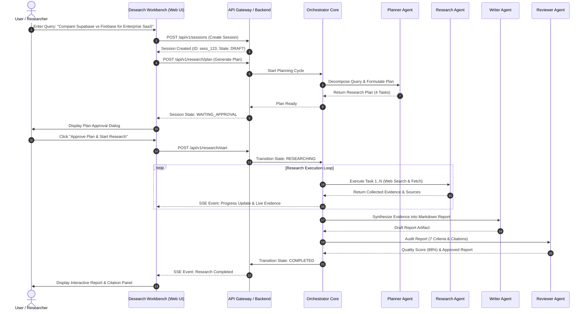
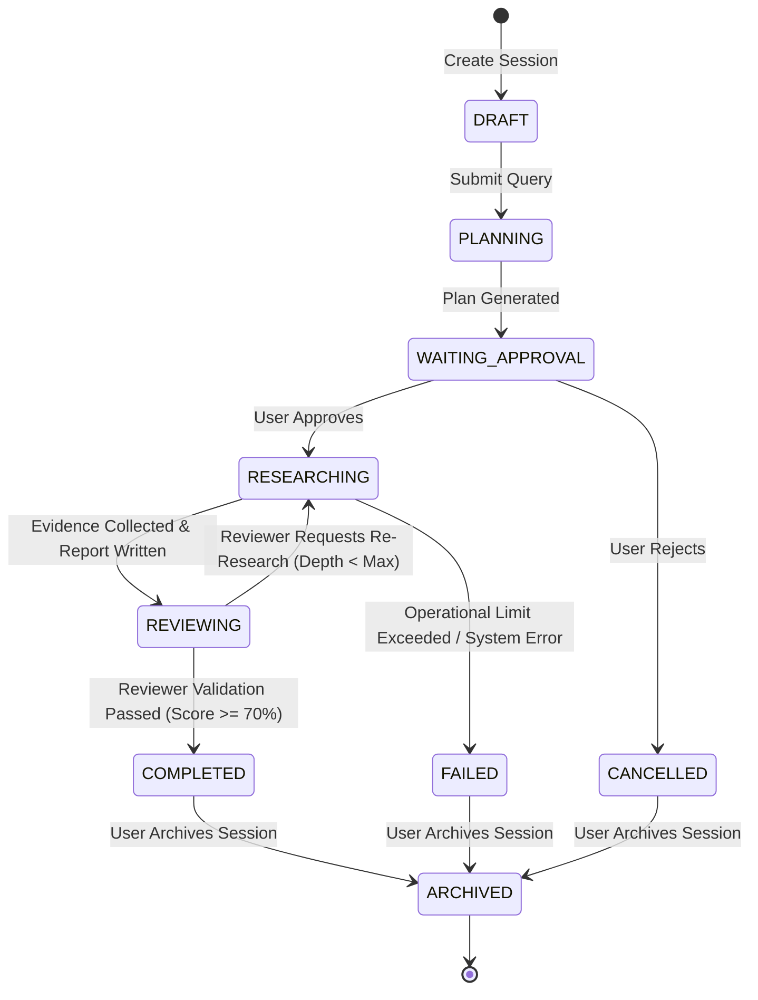

# Product Blueprint — Desearch AI (MVP Design Freeze)

> **Document Status:** FROZEN DESIGN BLUEPRINT  
> **Version:** 1.1.0  
> **Project:** Desearch AI  
> **Tagline:** Deep Research. Smarter Decisions.  
> **Role:** Principal Product Architect & Lead AI Systems Engineer  
> **Target Release:** Phase 2 MVP  

---

## 1. Product Vision

### 1.1 What Desearch AI Is
**Desearch AI** is a production-grade, open-source AI Research & Workbench platform powered by a modular multi-agent orchestration architecture. It transforms raw, ambiguous queries into highly structured, evidence-backed intelligence reports with full source attribution, verification controls, and human-in-the-loop checkpoints.

### 1.2 Who It Is For
- **Product Managers & Analysts**: Conducting competitive benchmarking, vendor evaluations, and technical trade-off analyses.
- **Software Architects & Engineers**: Evaluating cloud infrastructure, framework capabilities, and architectural paradigms (e.g., canonical query: *"Compare Supabase vs Firebase for Enterprise SaaS"*).
- **Technology Executives**: Seeking authoritative, hallucination-free executive summaries with verifiable citations.

### 1.3 What Problem It Solves
Traditional search engines return millions of unorganized, promotional links. Standard single-prompt LLMs hallucinate facts, fail on deep technical comparative reasoning, and lack verifiable references. Desearch AI solves this by deploying specialized autonomous agents operating in structured research cycles: breaking down complex queries, gathering multi-source web evidence, cross-verifying facts, and generating publication-ready Markdown reports with transparent confidence scores.

### 1.4 Explicit Product Non-Goals (What It Intentionally Does NOT Solve)
- **NO Real-Time Financial Trading Advice**: Not an automated stock or crypto trading tool.
- **NO Autonomous Code Execution**: Does not execute unvetted code in sandbox environments.
- **NO Multimodal Video/Audio Processing**: Focuses exclusively on text-based web sources and document inputs for MVP.
- **NO Multi-Tenant Enterprise RBAC**: Designed for single-user local/cloud deployments in MVP.
- **NO Local Hardware Model Hosting**: Relies exclusively on Google Gemini 1.5 Flash via Google AI Studio free tier.

---

## 2. Target Users & Typical Workflow

### 2.1 Primary User: Technical Product Lead / Systems Architect
- **Goal**: Needs a comprehensive comparative analysis of technical solutions (e.g., Supabase vs. Firebase).
- **Pain Point**: Spending 6–8 hours reading documentation, blog posts, and GitHub issues to synthesize trade-offs.

### 2.2 Secondary User: Technical Researcher / Engineering Executive
- **Goal**: Requires quick, high-level executive summaries with clear source attribution for strategy decisions.
- **Pain Point**: Inability to trust raw LLM outputs due to hallucination risks.

### 2.3 Typical User Workflow
1. User logs into Desearch AI Workbench and initiates a new Research Session.
2. User submits the research query: *"Compare Supabase vs Firebase for Enterprise SaaS"*.
3. **Planner Agent** generates a structured 4-step research execution plan.
4. User reviews and approves the execution plan via **Human-in-the-Loop Approval Dialog**.
5. **Research Agent** executes web queries, fetches web pages, and extracts structured evidence.
6. **Writer Agent** synthesizes collected evidence into a structured Markdown research report.
7. **Reviewer Agent** evaluates the draft against 7 quality criteria and validates fact citations.
8. User views the final report with embedded citations, confidence metrics, and live execution traces.

---

## 3. MVP Scope Boundary & Freeze

```text
┌─────────────────────────────────────────┬─────────────────────────────────────────┐
│              IN MVP SCOPE               │            OUT OF MVP SCOPE             │
├─────────────────────────────────────────┼─────────────────────────────────────────┤
│ • Canonical Research Queries (Text)     │ • Multi-Provider Selection UI           │
│ • Single LLM Engine (Google Gemini)     │ • Video / Audio Source Processing       │
│ • 4 Core Autonomous Agents              │ • Custom User-Defined Agent Pipelines   │
│ • Web Search & Page Scraping Tools      │ • Local LLM Inference (Ollama / vLLM)   │
│ • Human Plan Approval Checkpoint        │ • Complex Multi-Tier Enterprise RBAC    │
│ • Markdown Report Generation with       │ • Real-time Collaborative Editing       │
│   Fact Citations & Confidence Model     │ • Custom PDF/DOCX Export Engines        │
│ • In-Memory & Supabase Session Memory   │ • Automated Social Media / RSS Ingestion│
│ • FastStream / SSE Real-time Timeline   │ • Automated Scheduled Recurring Scrapes │
└─────────────────────────────────────────┴─────────────────────────────────────────┘
```

---

## 4. End-to-End User Journey



---

## 5. Research Session Lifecycle State Machine



### State Definitions & Transition Rules

1. **DRAFT**: Session initialized; awaiting user research query.
2. **PLANNING**: Planner Agent is analyzing query context and building task sub-goals.
3. **WAITING_APPROVAL**: Research execution plan generated; blocked awaiting human review.
4. **RESEARCHING**: Research Agent is actively executing web searches, fetching pages, and extracting evidence.
5. **REVIEWING**: Writer Agent has completed report drafting; Reviewer Agent is evaluating against 7 quality criteria.
6. **COMPLETED**: Quality score threshold satisfied ($\ge 70\%$); report finalized and persisted.
7. **FAILED**: Terminal failure encountered (e.g., max retries exceeded, unrecoverable tool error).
8. **CANCELLED**: Aborted explicitly by user during planning approval or execution.
9. **ARCHIVED**: Read-only historical session state.

---

## 6. Agent Architecture (MVP Core)

### 6.1 Planner Agent
- **Purpose**: Deconstructs ambiguous queries into a sequential, targeted multi-step research execution plan.
- **Inputs**: User query, session parameters.
- **Outputs**: Structured `ResearchPlan` (list of target tasks, search queries, and expected outputs).
- **Responsibilities**: Sub-goal decomposition, domain restriction identification.
- **Must NOT Do**: Perform web searches, fetch web pages, or draft final reports.
- **Communication Path**: Interacts exclusively with the Orchestrator Core.

### 6.2 Research Agent
- **Purpose**: Executes web searches, retrieves raw web documents, parses clean text, and extracts structured evidence.
- **Inputs**: `ResearchTask` definitions assigned by Orchestrator.
- **Outputs**: `EvidenceItem` records with source metadata (URL, page title, published date, raw snippet).
- **Responsibilities**: Web searching, HTML page fetching, text extraction, source attribution.
- **Must NOT Do**: Formulate overarching strategy, alter execution plan, or write final report.
- **Communication Path**: Interacts with Tool Registry and Orchestrator Core.

### 6.3 Writer Agent
- **Purpose**: Synthesizes verified evidence into a cohesive, publication-quality Markdown report.
- **Inputs**: Structured evidence records, original research query, execution plan summary.
- **Outputs**: Draft `ResearchReport` containing standard sections (Executive Summary, Technical Comparison, Trade-offs, Recommendation, Sources).
- **Responsibilities**: Fact synthesis, report structuring, inline citation generation (`[Source #]`).
- **Must NOT Do**: Fabricate unverified claims, perform web searches directly, or evaluate quality scores.
- **Communication Path**: Interacts exclusively with the Orchestrator Core.

### 6.4 Reviewer Agent
- **Purpose**: Evaluates draft research reports against 7 quantitative quality criteria and calculates confidence metrics.
- **Inputs**: Draft `ResearchReport`, collected evidence items, research plan.
- **Outputs**: `EvaluationResult` (Quality score 0–100%, pass/fail status, critique notes, citation verification status).
- **Responsibilities**: Citation integrity audit, contradiction detection, completeness checking.
- **Must NOT Do**: Re-write report text directly or alter raw evidence records.
- **Communication Path**: Interacts exclusively with the Orchestrator Core.

---

## 7. Tool Registry

```text
┌───────────────────┬───────────────────────────────────┬─────────────────────────────┬───────────────────────────┬──────────────┐
│     TOOL NAME     │             PURPOSE               │           INPUTS            │          OUTPUTS          │ OWNER AGENT  │
├───────────────────┼───────────────────────────────────┼─────────────────────────────┼───────────────────────────┼──────────────┤
│ Web Search        │ Execute targeted Web Queries      │ query: str, max_results: int│ List[{title, url, snippet}]│ Research     │
│ Web Page Fetch    │ Retrieve HTML & parse body text   │ url: str, timeout: int      │ {content: str, status: int}│ Research     │
│ Document Reader   │ Read local PDF/TXT uploaded files │ file_path: str              │ {text: str, pages: int}   │ Research     │
│ Citation Extractor│ Verify quote alignment with URL   │ text: str, source_url: str  │ {is_valid: bool, score}   │ Reviewer     │
└───────────────────┴───────────────────────────────────┴─────────────────────────────┴───────────────────────────┴──────────────┘
```

---

## 8. Human-in-the-Loop (HITL) Checkpoints

### 8.1 Plan Approval Checkpoint
- **Trigger**: When Orchestrator receives `ResearchPlan` from Planner Agent.
- **User Actions**:
  1. **Approve**: Starts research execution immediately.
  2. **Modify Plan**: Edits sub-task query strings or removes unneeded tasks.
  3. **Reject**: Cancels session (`CANCELLED` state).

### 8.2 Operational Safeguard Thresholds
- If Research Agent exceeds **15 sources** or **3 recursion cycles**, system pauses execution and requests user confirmation via UI prompt before proceeding.

---

## 9. Memory Architecture

```text
┌─────────────────────────────────────────────────────────────────────────────────┐
│                                MEMORY SCHEME                                    │
├───────────────────┬──────────────────────────────────────┬──────────────────────┤
│    MEMORY TYPE    │               CONTENTS               │ PERSISTENCE STRATEGY │
├───────────────────┼──────────────────────────────────────┼──────────────────────┤
│ Session Memory    │ Session state, config, metadata      │ Supabase PostgreSQL  │
│ Working Memory    │ Active execution plan, transient     │ In-Memory Context    │
│                   │ tool outputs, intermediate snippets   │                      │
│ Final Memory      │ Synthesized evidence, verified       │ Supabase PostgreSQL  │
│                   │ report, evaluation metrics           │ & Supabase Storage   │
└───────────────────┴──────────────────────────────────────┴──────────────────────┘
```

---

## 10. High-Level Database Domain Model

```text
+-----------------------+       1:N       +-----------------------+
|    ResearchSession    |----------------<|     ResearchTask      |
+-----------------------+                 +-----------------------+
| id: UUID              |                 | id: UUID              |
| query: String         |                 | session_id: UUID      |
| status: Enum          |                 | title: String         |
| created_at: Timestamp |                 | status: Enum          |
+-----------------------+                 +-----------------------+
            |                                         |
            | 1:1                                     | 1:N
            v                                         v
+-----------------------+                 +-----------------------+
|    ResearchReport     |                 |       Evidence        |
+-----------------------+                 +-----------------------+
| id: UUID              |                 | id: UUID              |
| session_id: UUID      |                 | task_id: UUID         |
| content_markdown: Text|                 | url: String           |
| quality_score: Float  |                 | snippet: Text         |
+-----------------------+                 +-----------------------+
```

---

## 11. Storage Architecture

- **Supabase Storage Bucket**: `research-reports`
  - `/reports/{session_id}/report.md` — Final Markdown report artifact.
  - `/reports/{session_id}/evidence_summary.json` — Consolidated evidence export.
  - `/reports/{session_id}/trace_log.json` — Operational trace logs.

---

## 12. Planned API Endpoints

### Sessions
- `POST /api/v1/sessions` — Create new research session.
- `GET /api/v1/sessions` — List historical research sessions.
- `GET /api/v1/sessions/{id}` — Retrieve detailed session state.

### Research Workflow
- `POST /api/v1/research/plan` — Generate research execution plan.
- `POST /api/v1/research/approve` — Approve execution plan and start research.
- `POST /api/v1/research/cancel` — Cancel active research session.

### Artifacts & Streams
- `GET /api/v1/reports/{session_id}` — Retrieve generated Markdown report.
- `GET /api/v1/sessions/{session_id}/stream` — SSE endpoint for live execution logs and progress events.

---

## 13. Frontend Screen Architecture

1. **Dashboard (`/`)**: Session history list, quick research input box, active session status widgets.
2. **Research Workspace (`/sessions/[id]`)**: Main interactive research hub.
3. **Execution Timeline Panel**: Real-time step-by-step progress timeline driven by SSE events.
4. **Evidence Panel**: Interactive drawer listing discovered sources, extracted snippets, and URL links.
5. **Human Approval Dialog**: Interactive modal presenting the generated research plan for user editing/approval.
6. **Report Viewer**: Rich Markdown renderer with syntax highlighting, inline source tooltips, and copy buttons.
7. **Settings Modal**: API key configuration, max sources limit, and model parameters locked to Google Gemini 1.5 Flash.

---

## 14. Real-Time Streaming & Observability

- **Protocol**: Server-Sent Events (SSE) via `/api/v1/sessions/{session_id}/stream`.
- **Event Types**:
  - `event: plan_created` — Payload: `ResearchPlan` object.
  - `event: task_started` — Payload: `{ task_id, title }`.
  - `event: evidence_found` — Payload: `EvidenceItem` object.
  - `event: report_chunk` — Payload: Partial Markdown stream for report rendering.
  - `event: state_changed` — Payload: `{ new_state }`.

---

## 15. Error Recovery Strategies

- **Web Search Failure**: Retry 3 times with exponential backoff; if persistent, fallback to cached domain query.
- **Page Fetch Error (403/500)**: Skip unreachable URL, mark source as unavailable, proceed to next source link.
- **LLM Rate Limit (429)**: Backoff for 5 seconds; retry up to 3 times before raising `ExternalServiceException`.
- **User Cancellation**: Immediately signal background tasks via `asyncio.Event` cancellation token.

---

## 16. Security & Operational Guardrails

- **Authentication**: Bearer token / Supabase Auth header validation.
- **Input Sanitization**: Pydantic v2 strict schema validation on queries and URLs.
- **Secrets Management**: Environment variables via `pydantic-settings` (`.env`), never exposed to frontend bundles.
- **Rate Limiting**: In-memory sliding window rate limiter (60 requests/minute per client).

---

## 17. Free-Tier Cloud Deployment Stack (Frozen Target)

```text
┌─────────────────────────────────────────────────────────────────────────────────┐
│                    FREE-TIER CLOUD DEPLOYMENT STACK                             │
├──────────────────┬───────────────────────────────┬──────────────────────────────┤
│    COMPONENT     │         FREE-TIER STACK       │          TIER LIMITS         │
├──────────────────┼───────────────────────────────┼──────────────────────────────┤
│ Frontend Web UI  │ Vercel                        │ Free hobby tier (Next.js)    │
│ Backend Service  │ Render                        │ Free Web Service instance    │
│ Database & Auth  │ Supabase PostgreSQL           │ Free 500 MB database         │
│ Object Storage   │ Supabase Object Storage       │ Free 1 GB storage bucket     │
│ Managed LLM API  │ Google AI Studio (Gemini 1.5) │ Free 15 RPM / 1M TPM         │
└──────────────────┴───────────────────────────────┴──────────────────────────────┘
```

---

## 18. Future Scope & Non-MVP Expansion (Post-Phase 2)

- Multi-provider LLM abstraction & selection UI (OpenAI GPT-4o, Anthropic Claude 3.5).
- Multi-modal research inputs (audio transcripts, YouTube video summarization).
- Collaborative real-time multi-user research workspaces.
- Custom Webhook integrations (Slack / Discord research notifications).
- Fine-tuned local model deployment support (Ollama, vLLM).

---

## 19. Design Freeze Checklist

- [x] **MVP Scope Frozen**: Single LLM provider (Google Gemini) and exact MVP scope boundaries established.
- [x] **Deployment Stack Frozen**: Canonical single-target deployment stack locked (Vercel, Render, Supabase, Google AI Studio).
- [x] **Agents Frozen**: 4 core agents (Planner, Research, Writer, Reviewer) locked.
- [x] **User Journey Frozen**: End-to-end flow and state machine transitions established.
- [x] **Tool List Frozen**: 4 core tools (Web Search, Fetch, Reader, Citation Extractor) finalized.
- [x] **API List Frozen**: Standard session, research, and report endpoints specified.
- [x] **Screen List Frozen**: 7 core UI screens/panels locked.
- [x] **Ready for Phase 2 Implementation**: All architectural contracts complete.

---

*This blueprint represents the official frozen design spec for Desearch AI Phase 2. No architectural modifications or feature additions may be made during Phase 2 code implementation without explicit change request approval.*
